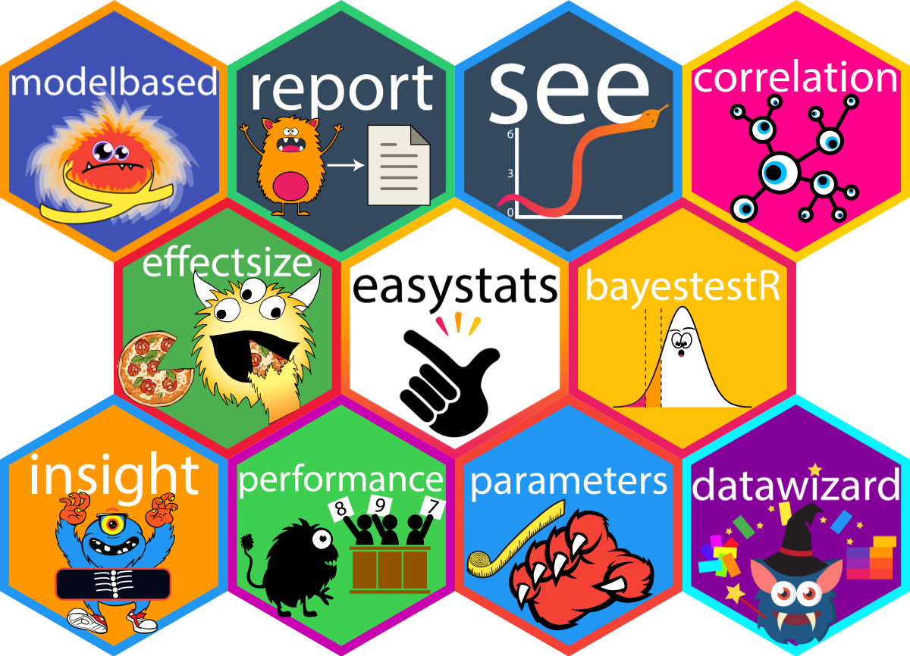

<!-- TOC JAVASCRIPT ELEMENTS -->

```{=html}
<script>
function toggle () {
  document.getElementById("TOC").classList.toggle("hide");
};

window.addEventListener('DOMContentLoaded', () => {

  const observer = new IntersectionObserver(entries => {
    entries.forEach(entry => {
      const id = entry.target.getAttribute('id');
      if (entry.intersectionRatio > 0) {
        document.querySelector(`[href="#${id}"]`).parentElement.classList.add('active');
      } else {
        document.querySelector(`[href="#${id}"]`).parentElement.classList.remove('active');
      }
    });
  });

  // Track all headings that have an `id` applied
  document.querySelectorAll('h1[id], h2[id], h3[id], h4[id], h5[id], h6[id]').forEach((h1, h2, h3, h4, h5, h6) => {
    observer.observe(h1, h2, h3, h4, h5, h6);
  });
  
});
</script>
```
<!-- TOC HTML ELEMENTS -->

<input type="button" class="d-article-with-toc" id="TOC" value="&#x2630" title="Toggle (Hide/Show) Table of Contents" alt="Toggle button for hiding/showing the Table of Contents" onclick="toggle()" style="padding:7px; border: 0px;"/>

```{r include=FALSE}
knitr::opts_chunk$set(message=F, warning=F)
```

# イントロダクション

## ドキュメントの概要

本ドキュメントの目的は、効果量（effect size）の理論と計算法に関する基礎的な内容をまとめることにある。 具体的には、効果量の定義、種類、Rによる計算法、解釈、統合の方法などを扱う。

近年、多くの研究スタンダードが帰無仮説検定の結果としてp値だけでなく効果量とその信頼区間を報告することを求めている[e.g., @american2019publication, p.89]。 しかしながら、効果量に関して網羅的にまとめられた日本語の無料ドキュメントが管見の限り無かったため、本ドキュメントの作成に至った。 著者は統計の専門家ではないため、読者自身で内容の正しさを確認しながら読み進めていただきたい。

## 効果量とは何か

効果量の記載を推奨する文献が多く存在する一方で、効果量の定義について述べた文献は驚くほど少ない[@dragicevic2020mean]。それでも数少ない例をあたれば、効果量に関する初期の定義は、効果量という言葉を広めた [Jacob Cohen](https://en.wikipedia.org/wiki/Jacob_Cohen_(statistician)) の1977年の著作に見ることができる。

> The "effect size," that is, the degree to which the phenomenon exists. [@cohen1977statistical , p.4]

この記述から、Cohen自身は効果量を**ある現象が存在する程度を表す量**として捉えていたことが読み取れる。この表現の意味を正確に理解するためには、Neyman-Pearson流の統計的帰無仮説検定（ Null Hypothesis Significance Testing, NHST）の枠組みを考える必要がある。 NHSTの枠組みにおいて、帰無仮説はある現象が存在しない状態を表す仮説、対立仮説はある現象が存在する状態を表す仮説として設定されることが多い。 例えば、ある病気の発症率の性差を検討する場合、性別間で発症率に差がないという帰無仮説は、発症率の性差という現象が存在しないという状態を表現している。 他方で対立仮説は現象が存在する状態を表し、その強度が効果量として量的に表現されるのである。別の言い方をすれば、効果量は「帰無仮説が偽である程度」も意味する[@cohen1977statistical, pp.9-10]。

効果量の定義に言及した最近の文献では、「効果量とは単に**研究者が関心を持つ事柄の大きさで**ある（原文：An effect size is simply the size of anything that may be of interest.）」とされている[@cumming2012understanding, p.34]。Cohenの定義と異なり、現象の実在性を問題とせず研究者が関心を持つ対象の大きさとして扱っている点や、NHSTの枠組みに依存していない点が特徴的である。何を関心の対象とするかは研究者が自由に決めることができる。

これらの効果量の定義は広義の効果量と呼ばれ、狭義の効果量の定義とは区別されることがある。効果量には測定単位に依存しない形で表現される標準化効果量（e.g., Cohen's d）と、測定単位に依存する非標準化効果量（e.g., 平均値差）の2種類が存在する。広義の効果量の定義が両者を効果量に含めるのに対して、狭義の効果量の定義では標準化効果量のみを効果量として扱う。一部の文献では狭義の効果量の定義のみを効果量の定義として記載している[@everitt2010cambridge; @ialongo2016]。この背景には、標準化効果量の方が研究間で比較しやすいという考えがあると推察される。@ives2003 は理想的な効果量の特徴として、次の3点を挙げている。

1.  結果の実質的な有意性を測るものである
2.  標本サイズに依存しない
3.  測定単位に依存しない

このうち、3番目の特徴は標準化効果量のみが持つ性質だが、測定単位に依存しない（metric free）という性質は研究間に比較・統合の容易性や、検定力を分析する際の利便性などから重宝される。しかしながら、元の測定単位に意味のある状況では、標準化効果量より非標準化効果量の方が好まれることもある[@wilkinson1999, p.599]。また、複数の標本統計量を用いて算出される標準化効果量は、単一の標本統計量を用いて算出される非標準化効果量と比べて不確実性が増加するという理由で使用に反対する意見も存在する[@cummings2011]。 よって、どちらか一方に限定せず、両方の種類を適宜使用することが望ましいと考えられる。

[Jacob Cohen](https://en.wikipedia.org/wiki/Jacob_Cohen_(statistician)) 以降の効果量の定義についてレビューした Preacher and Kelley は、広義の定義が最も有用であると結論付けた上で、効果量を以下のように定義している。

> We define effect size as any measure that reflects a quantity of interest, either in an absolute sense or as compared with some specified value. [...] Although standardized effect sizes can be valuable, they are not always to be preferred over an effect size that is wedded to the original measurement scale, which may already be expressed in meaningful units that appropriately address the question of interest. [@preacher2011 , p.95]
>
> （著者訳）効果量とは、絶対的な意味で、あるいはある特定の値と比較して、関心のある量を反映するあらゆる尺度であると定義する。（中略）標準化された効果量は有用であるが、非標準化効果量よりも常に優先されるとは限らず、興味のある問題に適切に対応する意味のある単位で既に表現されている場合もある。

以上より、効果量の定義としては広義の定義を採用することが妥当だと考えられ、本ドキュメントも非標準化効果量と標準化効果量の両方を効果量として扱う。

なお、非標準化効果量という表現は標準化効果量の劣化版という誤った印象を与える可能性があることから、単純効果量（simple effect size）という表現を用いるべきだという主張も存在するが[e.g., @baguley2009, p.239]、このような表現は少なくとも日本語圏ではあまり普及していないことから、本ドキュメントでは採用しない。

効果量の定義に関するその他の議論については、@dragicevic2020mean や @kelley2012 などを参照されたい。

## 効果量を利用するメリット

効果量を利用することのメリットとして、@lakens2013 は次の3点を挙げている。

1.  効果の大きさを示すことができる
2.  研究間で効果の大きさを比較・統合することができる
3.  過去の研究の効果量は、新しい研究を行う際の検定力分析に利用することができる

Lakensはこれらのメリットを標準化効果量を前提として挙げているが、同様のメリットは非標準化効果量にも当てはまる。効果量を利用するメリットの1つは、従来のNHSTにおける帰無仮説が棄却できるかどうかの議論を超えて、どの程度の効果があるのかを定量的に示すことができる点にある。このような効果量は、同じ効果を表していて単位が共通であれば研究間で比較・統合することができる。例えば、今回得られた効果量が過去の研究と比べて大きいものなのかを比較することが考えられる。また、メタ分析のような効果量を量的統合方法は、母効果量や効果量の分布に関するより精度の高い推測を可能にする。このようにして蓄積された効果量の分布に関する情報は、新たな研究を行う際の検定力分析やサンプルサイズ設計に活用することができる。以上のように、研究において効果量を利用することには様々なメリットがある。

## 効果量の種類

効果量には様々な種類が提案されており、一説によればその数は40を超える[@kirk1996, pp.748-749]。Hubertyは、効果量の種類と歴史的な登場時期を下図のように整理している[@huberty2002, Figure 1]。このように、効果量は長い時間をかけて様々な種類が提案されてきたものであって、一定の時期にまとめて提案されたものではない。最近でも新たな効果量は提案され続けている[e.g., robust effect size: @vandekar2020]。


効果量には様々な種類があるが、d族（d family）とr族（r family）に大別する分類がよく用いられる[@rosenthal1994, p.234]。基本的に、d族の効果量は群間の平均値差に関する指標であり、r族の効果量はモデルで説明される分散の割合に関する指標である。このような分類は大まかな効果量の種類と共通した性質を整理する上では有用だが、これらの種類に当てはまらない効果量が存在することや、本ドキュメントの効果量の定義が非標準化効果量を含む広義の定義を採用していることを踏まえ、今回は採用しない。代わりに、より細かい効果量の分類に基づき、代表的な効果量の一部を以下の表のように整理した。表に示した効果量は、次章以降で具体的な計算法を紹介する。

|   種類   | 非標準化効果量 |                                    標準化効果量                                     |
|:----------:|:----------:|:---------------------------------------------:|
|  平均値  |     平均値     |                                         ー                                          |
| 平均値差 |   平均値差D    |                     Cohen's $d$, Hedges' $g$, Glass's $\Delta$                      |
|   相関   |   共分散COV    |                          積率相関 $r$, 点双列相関 $r_{pb}$                          |
|  分散比  |       ー       | $\eta^2$ , $\omega^2$ , $\eta_{p}^2$ , $\omega_p^2$ , $\eta_{G}^2$ , $\omega_{G}^2$ |
|   比率   |       ー       |                             リスク比$RR$ , オッズ比$OR$                             |

: 代表的な効果量（仮）

## 統計ソフトウェアRの準備

Rは無料の統計解析用ソフトウェアである。本ドキュメントでは、Rを用いて効果量に関する計算を実行する方法を示している。Rによる解析は効果量に関する理解を深める上で有用だと考えられるため、ぜひ実行しながら結果を確かめてほしい。Rの基本的な使い方に関しては無料の解説がWeb上に多く存在するため、そちらを参照されたい。

全ての分析はRだけでも実行可能だが、RStudioというソフトウェアからRを実行した方が利便性が高い。個人的には、[RStudioの無料版](https://www.rstudio.com/products/rstudio/download/)を利用することをお勧めする。著者はWindows11 + R4.2.1 + RStudio2022.02.3 の環境で動作確認をしている。

また、本ドキュメントでは追加のパッケージとして、`easystats`を使用している。`easystats`は、様々な統計量を扱うパッケージ群を包括したものであり、効果量に関する分析を行う上では非常に便利である。



以下のコードで`easystats`に関連するパッケージ群をインストールできる。

```{r eval=FALSE, message=FALSE, warning=FALSE}
install.packages("easystats", repos = "https://easystats.r-universe.dev")
```

# 平均値と推測統計の基礎

本章では、多くの読者にとってなじみが深い指標であろう**平均値**（相加平均）が効果量として解釈可能であることを示した上で、正規母集団から得られた標本を用いて母平均$\mu$ の点推定・区間推定を行うことを通して、推測統計の基礎を確認する。また、ベイズ統計に基づくアプローチについても紹介する。

## 効果量としての平均値

ある研究においてn個の観測値 $x_1, x_2, ..., x_n$ が得られたとき、平均値は以下の式で計算できる。 $$
\bar{x}=\frac{1}{n}(x_1+x_2+...+x_n)=\frac{1}{n}\sum_{i=1}^{n}x_i
$$ 平均は全観測値の重心を示すものであり、分布が左右対称の場合は全観測値の中心を示す。 研究間で同一の測定が実現しているとき、各研究から得られた平均値を比較可能である。 特に、元の測定単位における比較に関心がある場合、平均値を比較することは有用かもしれない。

## 母平均の推定

母集団における平均（母平均$\mu$）を知りたい場合、理想的には全数調査を行い平均値を計算すればよいが、このような調査はコストがかかるため多くの場合、現実的ではない。そこで、母集団からの抽出された標本を用いて母平均$\mu$を推定することを考える。

標本調査によって、平均$\mu=5$、分散$\sigma^2=1$の正規分布に独立に従う100個の標本が得られたとする。$$
x_1, x_2, ..., x_{100} \sim \mathcal{N}(5, 1)
$$ 実際には、得られた標本がどのような母数の分布に従うかは多くの場合、未知である。 得られた標本から母平均を推定することを考えてみよう。

### 点推定

標本から母平均 $\mu$ を点推定する場合、推定量には標本平均 $\bar{x}$ を用いる。 これは、大数の法則より、標本平均 $\bar{x}$ はサンプルサイズ $n$ が大きくなると母平均 $\mu$ に近づくという**一致性**を持つからである（$\bar{x}\stackrel{p}{\longrightarrow}\mu$）。 また、標本平均 $\bar{x}$ の期待値 $E[\bar{x}]=\mu$ となることから、サンプルサイズ $n$ に関係なく標本平均 $\bar{x}$ の期待値は母平均に一致するという**不偏性**を持つ。 よって、標本平均 $\bar{x}$ は母平均 $\mu$ の一致推定量かつ不偏推定量である。

このことを確かめるために、Rを使用して以下のようなシミュレーションを行ってみよう。ここでは毎回同じ結果が再現されるよう乱数の種を固定したうえで、平均 $\mu=5$、分散 $\sigma^2=1$ の正規分布に独立に従う $n$個の乱数を発生させ、それらの標本平均を求めるシミュレーションを $k$回繰り返している。例えば、サンプルサイズ $n=100$ の標本平均を算出することを1000回繰り返すと、その平均は5.000977になることが分かる。

```{r 標本平均の性質}
m <- NULL # 結果の格納用
n = 100   # サンプルサイズ
k = 1000  # シミュレーション回数
set.seed(123) # 乱数の種の固定
for(i in 1:k){
  dat <- rnorm(n, 5, 1) # 正規分布N(5,1)からn個の乱数を発生
  m[i] <- mean(dat)     # 標本平均の格納
}
mean(m)   # k個の標本平均の平均
```

$n$ や $k$ の値を変えながら様々な条件で標本平均の計算を繰り返すと以下のような結果が得られる。

| k \\ n | 1        | 5       | 10       | 20       | 100      | 1000     | 10000    |
|:-------|:---------|:--------|:---------|:---------|:---------|:---------|:---------|
| 1      | 4.439524 | 5.19357 | 5.074626 | 5.141624 | 5.090406 | 5.016128 | 4.997628 |
| 100    | 5.090406 | 5.03459 | 5.016128 | 5.029297 | 4.997628 | 5.000977 | 4.999479 |
| 1000   | 5.016128 | 4.99943 | 4.997628 | 4.994261 | 5.000977 | 4.999479 | 5.000115 |
| 10000  | 4.997628 | 4.99826 | 5.000977 | 5.003096 | 4.999479 | 5.000115 | 5.000157 |
| 100000 | 5.000977 | 5.00006 | 4.999479 | 4.998962 | 5.000115 | 5.000157 | 5.000010 |

: 標本平均のシミュレーション

表より、シミュレーション回数 $k=1$ の行を横に見ると、サンプルサイズ $n$ が増加するにつれて、標本平均 $\bar{x}$ が母平均 $\mu=5$ に近づく一致性が確認できる。また、シミュレーション回数 $k=100000$ の行を横に見ると、サンプルサイズ $n$ に関係なく標本平均 $\bar{x}$ の期待値が $\bar{x}$ が母平均 $\mu=5$ に一致する不偏性が確認できる。

### 区間推定

点推定が母数を標本から得られる1つの値で推定したのに対して、区間推定では標本から得られる2つの値で母数が含まれる区間を推定する。

点推定の場合と同様、平均$\mu=5$、分散$\sigma^2=1$の正規分布に独立に従う100個の標本が得られているとする。ここで標本平均の標本分布が$\mathcal{N}(\mu, \sigma^2/n)$ に従うことを利用すれば、任意の確率で母平均を含む信頼区間（Confidence Interval）を構成することができる。

#### 母分散既知の場合

母分散が既知の場合、95%信頼区間は、以下の式で求められる。 $$
\bar{x}-1.96\frac{\sigma}{\sqrt{n}}\leq\mu\leq\bar{x}+1.96\frac{\sigma}{\sqrt{n}}
$$ 上式は母数を含んでいるため、標本から直接計算することはできない。 すでに先行研究などから母分散が分かっている場合、その値を代入して計算すればよい。

```{r 標本平均の信頼区間}
n <- 100 # サンプルサイズ
set.seed(123) # 乱数の種の固定
x <- rnorm(n, 5, 1) # 正規分布N(5,1)から100個の乱数を発生
m <- mean(x) # 標本平均
m - 1.96*1/sqrt(n) # 95%信頼区間の下限値
m + 1.96*1/sqrt(n) # 95%信頼区間の上限値
```

#### 母分散未知の場合

母分散が未知でもnが十分に大きい場合は、標本の標準偏差を$\sigma$に代入して計算してもよい（一致性があるため）。 母分散が未知でnが小さい場合、$\frac{\bar{x}-\mu}{\sigma/\sqrt{n}}$ が自由度 $n-1$ のｔ分布に従うことを利用して、95%信頼区間は以下の式で求められる。 ここで、$\hat{\sigma}$ は母標準偏差の推定値であり、標本の標準偏差を代入して計算する。$$
\bar{x}-t_{0.025}(n-1)\frac{\hat{\sigma}}{\sqrt{n}}\leq\mu\leq\bar{x}+t_{0.975}(n-1)\frac{\hat{\sigma}}{\sqrt{n}}
$$ Rでは、`qt()`を用いてｔ分布の任意の確率点を算出することができる。サンプルサイズを $n=20$ に変更して、95%信頼区間を求めてみよう。

```{r}
n <- 20             # サンプルサイズ
set.seed(123)       # 乱数の種の固定
x <- rnorm(n, 5, 1) # 正規分布N(5,1)からn個の乱数を発生
m <- mean(x)        # 標本平均
s <- sd(x)          # 標準偏差
m - qt(0.025, n-1, lower.tail = F)*s/sqrt(n) # 95%信頼区間の下限値
m + qt(0.975, n-1)*s/sqrt(n)                # 95%信頼区間の上限値
```

既存の関数を利用して95%信頼区間を求めても結果は一致する。

```{r}
t.test(x)$conf.int     # 既存の関数を利用した場合
```

95%信頼区間の意味するところは、標本調査を何回も繰り返してその度に95%信頼区間を構成した場合、95%の確率でそれらの区間内に母数が含まれている区間であるということである。 個々の信頼区間が母数を含むかどうかはTrue/Falseの2択であり、確率的な表現ができているわけではない。 実験を何回も繰り返すことのできる研究分野や様々な研究者によって類似の研究が繰り返される分野では、信頼区間の概念が想像しやすいだろう。 他方で、実験を繰り返すことが困難な分野では、1回の調査で得られたデータから任意の確率で母数を含む区間を構成したいと考えるかもしれない。 そこで、次の節ではベイズ統計の考え方を紹介し、ベイズ信用区間（Credible Interval）を構成する。

## ベイズ統計に基づくアプローチ

いま、正規母集団 $\mathcal{N}(\mu, \sigma^2)$ から大きさｎのデータを得たとする。この標本から母平均 $\mu$ を区間推定することを考える。ベイズ統計では、母数に関する事前の信念を確率モデルを用いて表現する（事前分布）。そして、ベイズの定理を用いて、事前分布と尤度から、データを得た後の事後分布を求める。

ここでは、母分散が既知であるのに対して、母平均 $\mu$ に関して少ない情報しか持っておらず、 $\mu$ の事前分布を一様分布と設定したとしよう。観測されたデータを用いて事前分布を更新すれば、事後分布は $\mathcal{N}(\bar{x}, \sigma/\sqrt{n})$ になる。この事後分布を利用して95%の確率で母平均 $\mu$ を含む区間を構成すれば、95%信用区間は以下の通りになる。

$$
\bar{x}-1.96\frac{\sigma}{\sqrt{n}}\leq\mu\leq\bar{x}+1.96\frac{\sigma}{\sqrt{n}}
$$

こうして構成した信用区間は、信頼区間とまったく異なる概念であることに注意が必要である。95%信用区間は、その区間内に95%の確率で母数が存在すると信用できる区間である。繰り返しの調査を前提とする必要はない。

## 結果の報告

非標準化効果量として平均値を報告する際には、以下の3点を報告すればよい。

1.  母平均の推定値（標本平均）

2.  推定値の不確かさ（95%信頼区間など）

3.  推定値の単位

例）今回得られた標本における長さの平均は5.14cm, 95% CI [4.69, 5.60] であった。

# 平均値差の効果量

本章では、２群間の平均値差に関する効果量とその信頼区間の計算方法を紹介する。平均値差に関する標準化効果量には複数の種類が存在するが、研究によってそれらの呼び方や使用する記号が異なることがあるので注意が必要である。

## 独立した2群の平均値差

2つの独立した母集団A, Bから抽出した2標本の平均値差について検討する。いま、2つの正規母集団 $\mathcal{N_A}(60, 100), \mathcal{N_B}(50, 100)$ から無作為抽出によって100個ずつ（$m=100, n=100$）の独立な標本を得たとする。$$
A_1, A_2, ..., A_{m} \sim \mathcal{N}(60, 100),\\
B_1, B_2, ..., B_{n} \sim \mathcal{N}(50, 100)
$$

```{r}
m <- 100 ; n <- 100   # サンプルサイズ
set.seed(123)         # 乱数の種の固定
A <- rnorm(m, 60, 10) # 正規分布N(50,100)からm個の乱数を発生
B <- rnorm(n, 50, 10) # 正規分布N(60,100)からn個の乱数を発生
```

```{r echo=FALSE, class.source="fold-hide"}
group <- rep(c("A","B"), each=100)
dat <- data.frame(group=group, outcome=c(A, B))
library(see)
library(ggplot2)
ggplot(dat, aes(x = group, y = outcome, fill = group)) +
  geom_violindot(fill_dots = "black", dots_size = 7) +
  theme_modern() +
  scale_fill_material_d()
```

独立した2群の平均値差を示す効果量には、非標準化平均値差と標準化平均値差の2種類がある。また、後者については、等分散が仮定できる場合とできない場合に分けて考えることができる。以下で順に紹介していく。

### 非標準化平均値差

2群の平均値差Dは、以下の式で求められる。これは、平均値と同様に非標準化効果量の一種であり、元の測定単位における比較に関心がある場合などに有用である。

$$
平均値差D=\bar{A}-\bar{B}
$$ 平均値差Dは、母平均値差 $\mu_A-\mu_B$ の一致推定量かつ不偏推定量であり、平均$\mu_A-\mu_B$、分散 $\sigma_A^2/m+\sigma_B^2/n$ の正規分布に従う。母分散が既知の場合は、以下のように95%信頼区間を構成すればよい。

$$
D-1.96\sqrt{\frac{\sigma_A^2}{m}+\frac{\sigma_B^2}{n}}\leq\mu_A-\mu_B\leq D+1.96\sqrt{\frac{\sigma_A^2}{m}+\frac{\sigma_B^2}{n}}
$$ Rを利用すれば、以下のように計算できる。

```{r}
D <- mean(A) - mean(B)     # 非標準化平均値差
D - 1.96*sqrt(100/m+100/n) # 95%信頼区間の下限値
D + 1.96*sqrt(100/m+100/n) # 95%信頼区間の上限値
```

母分散が未知であるが集団間で等しいことが分かっている場合、2群に共通した分散を以下の通り求めて、母分散の推定値として利用する。ここで、$\hat\sigma_A^2$ は群Aの不偏分散、$\hat\sigma_B^2$ は群Bの不偏分差を指す。 $$
\hat\sigma^2=\frac{(m-1)\hat\sigma_A^2+(n-1)\hat\sigma_B^2}{m+n-2} 
$$ 平均値差の標本分布として、正規分布ではなく自由度 $m+n-2$ のｔ分布を利用して、以下の通り95%信頼区間を求める。 $$
D-t_{0.025}(m+n-2)\sqrt{\frac{\hat\sigma^2}{m}+\frac{\hat\sigma^2}{n}}\leq\mu_A-\mu_B\leq D+t_{0.975}(m+n-2)\sqrt{\frac{\hat\sigma^2}{m}+\frac{\hat\sigma^2}{n}}
$$ Rを利用すれば、以下のように計算できる。

```{r}
pooled_var <- ((m-1)*var(A)+(n-1)*var(B))/(m+n-2)  # 2群に共通した分散の推定値
D - qt(0.025, m+n-2, lower.tail = F)*sqrt(pooled_var/m + pooled_var/n)  # 95%信頼区間の下限値
D + qt(0.975, m+n-2)*sqrt(pooled_var/m + pooled_var/n)                  # 95%信頼区間の上限値
```

既存の関数を利用して95%信頼区間を求めても結果は一致する。

```{r}
t.test(A, B, var.equal = T)$conf.int
```

### 標準化平均値差

2群の標準化平均値差に関する母効果量$\delta$は以下の式で定義される。 $$
\delta=\frac{μ_A-μ_B}{σ}
$$ここで$μ_A$，$μ_B$はそれぞれ群A, 群Bの母平均、$σ$は2群に共通な母標準偏差である。

得られた標本から母効果量$\delta$を推定する場合、その推定量を標本効果量と呼ぶ。 標準化平均値差の標本効果量にはいくつかの種類が提案されている。等分散を仮定する場合と等分散を仮定しない場合に分けて順に紹介する。

使用するデータは前節と同様である。

```{r}
m <- 100 ; n <- 100   # サンプルサイズ
set.seed(123)         # 乱数の種の固定
A <- rnorm(m, 60, 10) # 正規分布N(50,100)からm個の乱数を発生
B <- rnorm(n, 50, 10) # 正規分布N(60,100)からn個の乱数を発生
```

なお、統計的帰無仮説検定によって2群の平均値差を検討する方法としてはｔ検定が知られており、検定統計量ｔがｔ分布に従うことを利用して、群間で平均値に差が無いという帰無仮説を棄却できるかどうかを判断する。

```{r}
t.test(A, B, var.equal = T) # 等分散を仮定する場合（Student's t-test）
t.test(A, B, var.equal = F) # 等分散を仮定しない場合（Welch's t-test）
```

### 等分散を仮定する場合

等分散を仮定する場合の標本効果量は主に2種類ある。 これは、2つの集団の分散をどのような計算式で統合（pool）するかの違いである。分散を統合する計算式には、標本分散を用いるものと不偏分散を用いるものがある。

標本分散を用いて統合する場合、以下の式になる。ここで、$s_A^2$ は群Aの標本分散、$s_B^2$ は群Bの標本分差を指す。

$$
s_A^2=\frac{1}{m}\sum_{i=1}^{m}(A_i-\bar{A}), s_B^2=\frac{1}{n}\sum_{i=1}^{n}(B_i-\bar{B}), \\
s_{pooled}=\sqrt\frac{ms_A^2+ns_B^2}{m+n}
$$ Rを利用すれば、以下のように計算できる。

```{r}
Va <- var(A)*(m-1)/m  # Aの標本分散
Vb <- var(B)*(n-1)/n  # Bの標本分散
s_pooled <- sqrt((m*Va+n*Vb)/(m+n))
```

不偏分散を用いて統合する場合、以下の式になる。ここで、$\hat\sigma_A^2$ は群Aの不偏分散、$\hat\sigma_B^2$ は群Bの不偏分差を指す。

$$
\hat\sigma_A^2=\frac{1}{m-1}\sum_{i=1}^{m}(A_i-\bar{A}), \hat\sigma_B^2=\frac{1}{n-1}\sum_{i=1}^{n}(B_i-\bar{B}) \\
\hat\sigma=\sqrt\frac{(m-1)\hat\sigma_A^2+(n-1)\hat\sigma_B^2}{m+n-2}
$$ Rを利用すれば、以下のように計算できる。

```{r}
sigma <- sqrt(((m-1)*var(A)+(n-1)*var(B))/(m+n-2))
```

2種類の推定量の間には、以下のような関係がある。 $$
\hat\sigma=s_{pooled}\sqrt{\frac{m+n}{m+n-2}}
$$

2種類の推定量を用いることでそれぞれ、Hedges & Olkin の $d$ とCohenの $d_s$ という効果量が計算できる。順に紹介していく。

#### Hedges & Olkin's $d$

1つ目は、Hedges & Olkin の $d$であり、平均値差を2群に共通した標準偏差（$s_{pooled}$）で割ることで得られる。これは、母効果量$\delta$の最尤推定量である[@hedges1985]。この式で計算したものを Cohen's $d$ と表現している文献もあるので、注意が必要である。

$$
d =\frac{\bar{A}-\bar{B}}{s_{pooled}} 
$$

誤差分散は以下の式で求められる。誤差分散の平方根を求めれば標準誤差になる。

$$
V_d=\frac{m+n}{mn}+\frac{d^2}{2(m+n-2)}
$$ Rを利用すれば、Hedges & Olkin の $d$ は以下のように計算できる。

```{r}
(mean(A)-mean(B))/s_pooled  # Hedges & Olkin's d
```

#### Cohen's $d_s$

2つ目は、Cohenの $d_s$ であり、平均値差を2群に共通した標準偏差（$\hat\sigma$）で割ることで得られる[@cohen1988]。この式で計算したものを Cohen's $d$ や Hedges' $g$ と表現している文献もあるので、注意が必要である。名称の混乱問題については本章の最後で解説する。

$$
Cohen's~d_s =\frac{\bar{A}-\bar{B}}{\hat\sigma} 
$$ 誤差分散は以下の式で求められる。誤差分散の平方根を求めれば標準誤差になる。 $$
V_{d_s}=\frac{m+n}{mn}+\frac {d_s^2}{2(m+n)} 
$$ Rを利用すれば、Cohenの $d_s$ は以下のように計算できる。

```{r}
(mean(A)-mean(B))/sigma  # Cohen's d_s
```

既存のパッケージを利用した場合でも同様の結果が得られる。

```{r}
library(effectsize)
cohens_d(A, B)  # Cohen's d_s
```

### 等分散を仮定しない場合

#### Glass's $\Delta$

等分散を仮定しない場合の標本効果量としては、Glassの $\Delta$ がある。 これは、実験デザインに由来して群間で分散が異なることが想定される場合に有用である。 例えば、実験群にのみ介入を行い、その介入が分散を拡大させると考えられる場合、介入を行っていない統制群の分散の推定値を効果量の計算に用いる方が適切だと考えられる[@grissom2001]。Glassの $\Delta$ はこのような考え方に基づき、2群のうち片方の群の分散（標準偏差）のみを用いて効果量を計算する。

なお、使用するデータは、分散を変更している。

```{r}
m <- 100 ; n <- 100   # サンプルサイズ
set.seed(123)         # 乱数の種の固定
A <- rnorm(m, 60, 12) # 正規分布N(50,144)からm個の乱数を発生
B <- rnorm(n, 50, 10) # 正規分布N(60,100)からn個の乱数を発生
```

Glassの $\Delta$ は以下の計算式の通り、平均値差を片方の群（統制群）の標準偏差で割ることで得られる[@glass1981]。ここで、$\hat\sigma_B^2$ は群Bの不偏分差を指す。ここでは、群Bが統制群であることを想定している。

$$
Glass's~\Delta =\frac{\bar{A}-\bar{B}}{\hat\sigma_B} 
$$

誤差分散は以下の式で求められる[@kline2004, p.108]。$$
V_{\Delta}=\frac{m+n}{mn}+\frac {\Delta^2}{2(n-1)} 
$$ Rを利用すれば、Glassの $\Delta$ は以下のように計算できる。

```{r}
(mean(A)-mean(B))/sd(B)  # Glass's delta
```

既存のパッケージを利用した場合でも同様の結果が得られる。

```{r}
library(effectsize)
glass_delta(A, B)  # Glass's delta
```

#### Cohen's $d_s$

なお、等分散が仮定できるが、分散の推定値に群間で差があった場合は、両群の情報を活用できる $d$ や $d_s$ を使用した方がいいだろう[@grissom2001]。例えば、分散の推定値に群間で差があった場合のCohenの $d_s$ は以下の通り計算することが推奨されている[@delacre2021]。ここで、$\hat\sigma_A^2$ は群Aの不偏分散、$\hat\sigma_B^2$ は群Bの不偏分差を指す。

$$
Cohen's~d_s=\frac{\bar{A}-\bar{B}}{\sqrt{(\hat\sigma_A^2+\hat\sigma_B^2)/2}}
$$

Rを利用すれば、分散が異なる場合のCohenの $d_s$ は以下のように計算できる。

```{r}
(mean(A)-mean(B))/sqrt((var(A)+var(B))/2)
```

既存のパッケージを利用した場合でも同様の結果が得られる。

```{r}
library(effectsize)
cohens_d(A, B, pooled_sd = F)
```

### 信頼区間

標準化平均値差の効果量の信頼区間を算出する方法には、1．標準誤差を用いる方法、2．非心ｔ分布に基づく方法、3．ブートストラップ法の3種類がある。以下で順に紹介する。なお、使用するデータは以下の通りである。

```{r}
m <- 100 ; n <- 100   # サンプルサイズ
set.seed(123)         # 乱数の種の固定
A <- rnorm(m, 60, 10) # 正規分布N(50,100)からm個の乱数を発生
B <- rnorm(n, 50, 10) # 正規分布N(60,100)からn個の乱数を発生
```

#### 標準誤差を用いる方法

1つ目は、標準誤差 $se$（誤差分散$V_{\hat\delta}$の平方根）を用いる簡易的な方法である。効果量の標本分布を正規分布で近似することで、95％信頼区間は以下のように計算できる[@nakagawa2007]。ここで、$\hat\delta$ は、母効果量 $\delta$ の推定値である標本効果量（$d, d_S, \Delta$）を指す。

$$
\hat{\delta}-1.96*se\leq\delta\leq\hat{\delta}+1.96*se
$$

例えば、Cohen's $d_s$ の95%信頼区間は以下のように求められる。

```{r}
library(effectsize)
ds <- cohens_d(A, B)  # Cohen's d_s
se_ds <- sqrt((m+n)/(m*n)+(ds$Cohens_d^2/(2*(m+n))))
ds$Cohens_d - 1.96*se_ds  # 95%信頼区間の下限値
ds$Cohens_d + 1.96*se_ds  # 95%信頼区間の上限値
```

しかし、これは簡易的な方法であって、正確ではない。より正確な方法としては次の2種類がある。

#### 非心ｔ分布に基づく方法

2つ目は、非心ｔ分布を用いる方法である。これは、以下の式で計算される検定統計量$t$が帰無仮説が偽のときに、非心度$λ$、自由度$df$の非心ｔ分布に従うことを利用する方法である。

今回の例の場合、自由度$df=198$の非心ｔ分布を非心度$λ$を変えながら描いていったとき、検定統計量$t$の実現値$t=1.48862$が上側確率0.975に一致する非心度$λ_L$を求める。そして、それに$\sqrt{\frac{mn}{m+n}}$ をかけることで効果量$\delta$に変換したものが効果量$d_s$の信頼区間の上限値になる。同様に、検定統計量$t$の実現値が下側確率0.025に一致する非心度$λ_H$を求めて変換すれば効果量$d_s$の信頼区間の下限値になる。非心ｔ分布の詳細については、[@haebara2014]などを参照されたい。※Glass's $\Delta$ の場合は、自由度$df$を$n-1$とする。

$$
t=d_s*\sqrt{\frac{mn}{m+n}},\\
\lambda=\delta*\sqrt{\frac{mn}{m+n}},\\
df=m+n-2
$$

Rを利用すれば、Cohen's $d_s$ の95%信頼区間は以下のように求められる。

```{r}
library(effectsize)
ds <- cohens_d(A, B)  # Cohen's d_s
t <- ds$Cohens_d*sqrt(m*n/(m+n)) # t値
df <- m+n-2 # 自由度
library(MBESS)
lambda.ci <- conf.limits.nct(t.value=t, df=df, conf.level = .95) # 非心t分布の95%点
lambda.ci$Lower.Limit*sqrt((m+n)/(m*n))  # 95%信頼区間の下限値
lambda.ci$Upper.Limit*sqrt((m+n)/(m*n))  # 95%信頼区間の上限値
```

既存のパッケージを利用した場合でも同様の結果が得られる。

```{r}
library(effectsize)
cohens_d(A, B)  # Cohen's d_s
```

ただし、この方法ではGlassの $\Delta$ の信頼区間を求めることができない（等分散の場合を除く）。その場合、次に示すブートストラップ法を用いる。

#### ブートストラップ法

3つ目は、ブートストラップ法を用いる方法である。ブートストラップ法とは、標本からの復元抽出を繰り返すことで大きな標本を生成し、そこから得られる近似分布（経験分布）によって標準誤差や信頼区間を求める方法である。ブートストラップ法では、母集団分布を仮定せずに信頼区間を計算することができるため便利である。

ここでは既存のパッケージを利用して、Cohen's $d_s$ の95%信頼区間を求める。R=10000回の復元抽出を行うよう設定している。

```{r}
dat <- data.frame(score=append(A, B), group=rep(c("A", "B"), each=100))
library(bootES)
set.seed(123)
bootES(data = dat, data.col = "score", group.col = "group", contrast = c("B","A"), 
       effect.type = "cohens.d", ci.conf = 0.95, R = 10000)
```

Glassの $\Delta$ の95%信頼区間も以下のように求められる。

```{r}
dat <- data.frame(score=append(A, B), group=rep(c("A", "B"), each=100))
library(bootES)
set.seed(123)
bootES(data = dat, data.col = "score", group.col = "group", contrast = c("B","A"), 
       effect.type = "cohens.d", glass.control = "B", ci.conf = 0.95, R = 10000)
```

### ベイズ統計に基づくアプローチ

ベイズ統計に基づき、母効果量とその信用区間について推論する方法を紹介する。なお、ここでの説明は、<https://sucre-stat.com/2021/06/bayesian-hypothesis-testing-2theory/> を参考にした。

いま、2つの独立した母集団A, Bから抽出した2標本がそれぞれ以下のように正規分布に従うとする。ここでは、それぞれの正規分布の平均が2群に共通した母平均 $\mu$ からどれだけ離れているかを母効果量パラメータ $\delta$ を組み込んで表現している。また、群間で分散は共通であると仮定している。

$$
\begin{cases}
A_i \sim \mathcal{N}\left(\mu - \cfrac{\delta \sigma}{2}, \sigma^2\right),~~~i=1,\ldots,m \\
B_j \sim \mathcal{N}\left(\mu + \cfrac{\delta \sigma}{2}, \sigma^2\right),~~~j=1,\ldots,n
\end{cases} 
$$

各パラメータの事前分布を以下のように設定する。これは、Jeffreys-Zellner-Siow（JZS）の事前分布と呼ばれるジェフリーズ事前分布の一種である。今回は、$r=1/\sqrt{2}$ とする。

$$
\begin{cases}
\delta \sim \mathrm{Cauchy}(0,r) \\
\pi\left(\sigma^2\right) ∝ \cfrac{1}{\sigma^2} \\
\pi\left(\mu\right) ∝ 1
\end{cases}
$$

JZSの事前分布を用いた場合の母効果量 $\delta$ の事後分布の式については割愛するが、以下のRコードでのMAP推定値と信用区間を求めることができる。

```{r}
set.seed(123)
A <- rnorm(100, 60, 10)
B <- rnorm(100, 50, 10)

library(BayesFactor)
bf <- ttestBF(A, B, paired = F) # ベイズファクター BF_10
library(bayestestR)
describe_prior(bf) # 事前分布
effectsize(bf, test = NULL) # 事後分布における効果量のMAP推定値
```

### 結果の報告

標準化平均値差を報告する際には、以下の4点を報告すればよい。

1.  効果の方向（2つの集団のどちらからどちらを引いたか。値が正の場合はどちらの集団が大きいことになるか。）
2.  効果量の種類（$d, d_S, \Delta$ など）
3.  効果量の点推定値
4.  推定の不確実性（95%信頼区間など）

Rを用いて以下のように結果報告の表や文章を出力することもできる。

```{r}
set.seed(123)
A <- rnorm(100, 60, 10)
B <- rnorm(100, 50, 10)

library(report)
report_table(t.test(A, B, var.equal = T)) # 表
report(t.test(A, B, var.equal = T)) # 文章
```

## 対応のある2群の平均値差

同一集団に対する2回の測定を行う状況を考える（プレ・ポストデザイン）。いま、下記の二変量正規分布に独立に従うn=100の2組（プレ・ポスト）の標本を得たとする。これは、プレの母平均が50、母分散が100、ポストの母平均が60、母分散が100、プレ・ポストの母相関が0.5であることを意味している。

$$
\begin{pmatrix} X_{pre} \\ X_{post} \end{pmatrix} \sim MultiNormal \left( \boldsymbol{\mu}, \boldsymbol{\Sigma} \right),\\
\boldsymbol{\mu} = \begin{pmatrix} 50 \\ 60 \end{pmatrix}, 
\boldsymbol{\Sigma} = \begin{pmatrix} 100 & 50 \\ 
50 & 100 \end{pmatrix}\\
$$

2つの測定値の差も正規分布に従う。

$$
X_{post}-X_{pre}\sim Normal(10, 100)
$$

Rを使って上記の分布に従う乱数を発生させてみよう。このデータを用いて後に示す効果量を計算していく。

```{r}
library(mvtnorm)
set.seed(123)
sigma <- matrix(c(100,50,50,100), byrow=TRUE, ncol=2) 
mu <- c(50, 60)
n <- 100
dat <- data.frame(rmvnorm(n=n, mean=mu, sigma=sigma)) 
colnames(dat) <- c("pre","post")
```

### 非標準化平均値差

プレ・ポストの平均値差Dは、以下の式で求められる。これは非標準化効果量の一種であり、元の測定単位における比較に関心がある場合などに有用である。 $$
D=\bar{x}_{post}-\bar{x}_{pre}
$$ 誤差分散は以下の式で求められる。$\hat\sigma^2_{pre}$ はプレの標準偏差、$\hat\sigma^2_{post}$ はポストの標準偏差、$r$ はプレとポストの相関係数を指す。 $$
V_D=\frac{\hat\sigma^2_{pre}+\hat\sigma^2_{post}-(2r*\hat\sigma^2_{pre}*\hat\sigma^2_{post})}{n}
$$

### 標準化平均値差

対応のある2群の平均値差の標準化効果量として、対応の無い場合の標準化効果量を用いる方法もある。しかしながら、これはプレ・ポストの相関を考慮しておらず、相関の大きさに関係なく常に一定の値になる。これは対応のあるｔ検定の結果とも対応しないことからやや不自然である。

そこで、相関を考慮した効果量として新たに以下のような母効果量を定義する[@kline2004, p.106]。ここで、$\mu_{D}$ はプレ・ポストの差の期待値、$σ_D$ はプレ・ポストの平均値差の母標準偏差、 $σ$ はプレ・ポストで共通な母標準偏差である。

$$
\delta_p=\frac{\mu_{D}}{\sigma_D}=\frac{\mu_{D}}{\sigma\sqrt{2(1-\rho)}}
$$ $\delta$ と $\delta_p$ では分母の計算式が異なる。 $\delta_p$ の場合、プレ・ポストの相関を含む平方根が新たに加わっている。式から分かる通り、同じ平均値差の場合、相関が大きくなるほど効果量も大きくなる。相関が大きいことは言い換えれば平均値差の標準偏差が小さいことを意味する。

また、相関の絶対値が0.5のとき、$\delta$ と $\delta_p$ は一致する。$\delta_p$ に $\sqrt{2(1-\rho)}$ をかければ $\delta$ に変換できる。

#### Cohen's $d_z$

母効果量 $\delta_p$ の推定量である標本効果量としては、Cohen の $d_z$ がある。 これは、プレ・ポストの平均値差を平均値差の標準偏差で割ることで得られる[@cohen1988, p.48]。ここで、$\hat\sigma_D$ は平均値差の標準偏差、$\hat\sigma_A^2$ は群Aの不偏分散、$\hat\sigma_B^2$ は群Bの不偏分差を指す。zという添え字は、@cohen1988 がXとYの差をZと表現したことに由来する。 $$
D=\bar{x}_{post}-\bar{x}_{pre}\\
Cohen's~d_z=\frac{D}{\hat\sigma_D}=\frac{D}{\sqrt{\hat\sigma_{pre}^2+\hat\sigma_{post}^2-2*cov(x_{pre}, x_{post})}}
$$ 誤差分散は以下の式で求められる。ここで、$r$ は、プレとポストの相関係数を指す。

$$
V_{d_z} = \dfrac{2(1-r)}{n}+\frac{d_z^2}{2n}
$$

Rを利用すれば、Cohen の $d_z$ は以下のように計算できる。

```{r}
mean(dat$post-dat$pre)/sd(dat$post-dat$pre)
```

既存のパッケージを利用した場合でも同様の結果が得られる。

```{r}
library(effectsize)
cohens_d(dat$post, dat$pre, paired = T) # Cohen's d_z
```

### 信頼区間

対応のある2群の平均値差の効果量の信頼区間の計算についても、独立した2群の場合と同様の3種類の方法が使用できる。ここでは、非心ｔ分布に基づく方法のみ紹介する。2つ目は、非心ｔ分布を用いる方法である。これは、以下の式で計算される検定統計量ｔが帰無仮説が偽のときに、非心度$λ$、自由度$df$の非心ｔ分布に従うことを利用する方法である。

今回の例の場合、自由度$df=99$の非心ｔ分布を非心度$λ$を変えながら描いていったとき、検定統計量$t$の実現値$t=9.587383$が上側確率0.975に一致する非心度$λ_L$を求める。そして、それに$\sqrt{n}$をかけることで効果量$\delta$に変換したものが効果量$d_s$の信頼区間の上限値になる。同様に、検定統計量$t$の実現値が下側確率0.025に一致する非心度$λ_H$を求めて変換すれば効果量$d_s$の信頼区間の下限値になる。非心ｔ分布の詳細については、[@haebara2014]などを参照されたい。

$$
t=d_z*\sqrt{n},\\
\lambda=\delta*\sqrt{n},\\
df=n-1
$$

Rを利用すれば、Cohen's $d_s$ の95%信頼区間は以下のように求められる。

```{r}
library(effectsize)
dz <- cohens_d(dat$post, dat$pre, paired = T) # Cohen's d_z
t <- dz$Cohens_d*sqrt(n) # t値
df <- n-1 # 自由度
library(MBESS)
lambda.ci <- conf.limits.nct(t.value = t, df=df, conf.level = .95) # 非心t分布の95%点
lambda.ci$Lower.Limit/sqrt(n)  # 95%信頼区間の下限値
lambda.ci$Upper.Limit/sqrt(n)  # 95%信頼区間の上限値
```

既存のパッケージを利用した場合でも同様の結果が得られる。

```{r}
library(effectsize)
cohens_d(dat$post, dat$pre, paired = T) # Cohen's d_z
```

### 結果の報告

対応のある2群の標準化平均値差を報告する際には、以下の5点を報告すればよい。

1.  効果の方向（値が正の場合はプレとポストのどちらが大きいことになるか。）
2.  効果量の種類（$d_z$ など）
3.  効果量の点推定値
4.  推定の不確実性（95%信頼区間など）
5.  プレとポストの相関係数r

Rを用いて以下のように結果報告の表や文章を出力することもできる。

```{r}
library(report)
report_table(t.test(dat$post, dat$pre, paired = T)) # 表
report(t.test(dat$post, dat$pre, paired = T)) # 文章
```

## 標準化平均値差の補正

標本から得られた統計量を用いて母効果量の推定値を算出する際に特定のバイアスが生じることが予想される場合、バイアスの原因に応じた補正を行うことが考えられる。ここでは、1．小標本の補正、2．信頼性の補正、3．範囲制限の補正を順に紹介する。

### 小標本の補正

1つ目の補正は小標本の補正である。これまでに紹介した標準化平均値差の効果量には母効果量の推定におけるバイアスが存在し、特に標本が小さい時に顕著である。このバイアスを補正する方法として、標本効果量に以下の補正係数を乗じる方法が提案されている。ここで、$df$ は自由度を表す。 $$
J\approx1-\frac{3}{4*df-1}
$$

#### Hedges' $g$

補正係数 $J$ をCohen's $d_s$に乗じることで、バイアスの補正された効果量が得られる。mとnは各群のサンプルサイズである。これは Hedges' $g$ と呼ばれ、母効果量 $\delta$ の不偏推定量である[@hedges1981]。

$$
J\approx1-\frac{3}{4(m+n-2)-1}\\
Heges'~g=J*d_s
$$ Rを利用すれば、Hedges の $g$ は以下のように計算できる。

```{r}
m <- 100 ; n <- 100   # サンプルサイズ
set.seed(123)         # 乱数の種の固定
A <- rnorm(m, 60, 10) # 正規分布N(50,100)からm個の乱数を発生
B <- rnorm(n, 50, 10) # 正規分布N(60,100)からn個の乱数を発生
library(effectsize)
d <- cohens_d(A, B)   # Cohen's d_s
d$Cohens_d * (1-(3/(4*(m+n-2)-1))) # Hedges' g
```

既存のパッケージを利用した場合でも同様の結果が得られる。

```{r}
library(effectsize)
hedges_g(A, B)
```

#### Glss's $\Delta_{adj}$

補正係数 $J$ をGlass's $\Delta$ に乗じることで、バイアスの補正された効果量 Glass's $\Delta_{adj}$が得られる[@grissom2005, p.54]。nは統制群のサンプルサイズである。

$$
J\approx1-\frac{3}{4(n-1)-1}\\
Glass's~\Delta_{adj}=J*\Delta
$$

Rを利用すれば、Glass の $\Delta_{adj}$ は以下のように計算できる。

```{r}
m <- 100 ; n <- 100   # サンプルサイズ
set.seed(123)         # 乱数の種の固定
A <- rnorm(m, 60, 12) # 正規分布N(50,144)からm個の乱数を発生
B <- rnorm(n, 50, 10) # 正規分布N(60,100)からn個の乱数を発生
library(effectsize)
delta <- glass_delta(A, B)  # Glass's delta
delta$Glass_delta * (1-(3/(4*(n-1)-1))) # Glass's delta_adjusted
```

既存のパッケージを利用した場合でも同様の結果が得られる。

```{r}
library(effectsize)
delta <- glass_delta(A, B)  # Glass's delta
library(psychmeta)
correct_glass_bias(delta$Glass_delta, nc=n, ne=m)
```

#### シミュレーション

これまでに紹介した平均値差の標本効果量が母効果量の推定値としてどのような性質を持つのかをシミュレーションによって確認しよう。以下のコードでは、各効果量について結果格納用の箱を作った上で、任意のサンプルサイズ$n$で効果量を算出する計算を10000回繰り返している。母効果量は $\delta=1$ であることから、バイアスが無ければ10000個の効果量の平均（期待値）と$\delta=1$の差は0に近づくはずである（i.e., 不偏性）。

```{r results='hide'}
library(effectsize)
d <- NULL     # Hedged & Olkin's d の箱
ds <- NULL    # Cohen's d_s の箱
g <- NULL     # Hedges'g の箱
delta <- NULL # Glass's delta の箱
delta_adj <- NULL # Glass's delta_adj の箱
n <- 5        # サンプルサイズ
k <- 10000    # シミュレーション回数
set.seed(123)
for(i in 1:k){
  A <- rnorm(n, 60, 10) # 正規分布に従う乱数A
  B <- rnorm(n, 50, 10) # 正規分布に従う乱数B
  svA <- sum((A-mean(A))^2)/n # 標本分散A
  svB <- sum((B-mean(B))^2)/n # 標本分散B
  poolsd <- sqrt((n*svA+n*svB)/(n+n)) #2群をプールした標準偏差
  d[i] <- (mean(A)-mean(B))/poolsd # Hedged & Olkin's d
  ds[i] <- cohens_d(A, B)$Cohens_d # Cohen's d_s
  g[i] <- hedges_g(A, B)$Hedges_g  # Hedges'g
  delta[i] <- glass_delta(A, B)$Glass_delta    # Glass's delta
  delta_adj[i] <- delta[i]*(1-(3/(4*(n-1)-1))) # Glass's delta_adj
}
# bias
round(mean(d)-1, 4)
round(mean(ds)-1, 4) ; round(mean(g)-1, 4)
round(mean(delta)-1, 4) ; round(mean(delta_adj)-1, 4)
```

$n$ の値を変えながらK=10000回のシミュレーションを繰り返すと、以下のような結果が得られる。

| EStype \\ n | 5      | 10      | 20      | 30     | 50      | 100     | 1000    |
|:------------|:-------|:--------|:--------|:-------|:--------|:--------|:--------|
| d           | 0.2491 | 0.0927  | 0.0431  | 0.0313 | 0.0162  | 0.0069  | 0.0008  |
| d_s         | 0.1172 | 0.0366  | 0.0167  | 0.0140 | 0.0060  | 0.0018  | 0.0003  |
| g           | 0.0085 | -0.0073 | -0.0035 | 0.0008 | -0.0018 | -0.002  | -0.0001 |
| delta       | 0.2649 | 0.0848  | 0.0382  | 0.0294 | 0.0139  | 0.0056  | -0.0007 |
| delta_adj   | 0.0119 | -0.0082 | -0.0034 | 0.0025 | -0.0016 | -0.0020 | -0.0000 |

: 標準化平均値差の効果量のバイアス

表より、補正係数を使用した$g$や$\Delta_{adj}$の方が補正係数を使用していない$d_s$や$\Delta$よりもバイアスが少ない（真値に近い）ことが読み取れる。特に、サンプルサイズが20以下の場合はその差が顕著であり、補正係数を使用した標本効果量の使用が望ましい[@kline2004]。

### 信頼性の補正

測定の信頼性が低い場合、効果量が少なく見積もられる減衰が問題になる。この問題に対して、測定の信頼性が分かっていればそれに応じた補正を行うことが提案されている[@hunter2004]。 標準化平均値差とその誤差分散については、以下の式で補正する。ここで、$d_s$ は Cohen の $d_s$、$r_{yy}$ は測定の信頼性を表す。

$$
df=m+n-2, \\
h=\frac{df}{m}+\frac{df}{n},  \\
r_{pb}=\frac{d_s\sqrt{d_s^2+h}}{d_s^2+h}, \\
r_{pb_c}=\frac{r_{pb}}{\sqrt{r_{yy}}},\\
d_c=\frac{r_{pb_c}\sqrt{h}}{\sqrt{1-r_{pb_c}^2}}, \\
V_{d_c}=\frac{V_{d_s}}{r_{yy}}
$$たとえば、標本A, Bに共通した測定の信頼性が0.7であった場合、標準化平均値差は以下のように補正できる。

```{r}
m <- 100 ; n <- 100   # サンプルサイズ
set.seed(123)         # 乱数の種の固定
A <- rnorm(m, 60, 10) # 正規分布N(50,100)からm個の乱数を発生
B <- rnorm(n, 50, 10) # 正規分布N(60,100)からn個の乱数を発生
r_yy <- 0.7  # 信頼性係数
library(effectsize)
d <- cohens_d(A, B)$Cohens_d   # Cohen's d_s

df = m + n - 2
h = df/m + df/n
rpb = (d * sqrt(d^2 + h))/(d^2 + h)
rpbc = rpb/sqrt(r_yy)
dc = (rpbc * sqrt(h))/sqrt(1 - rpbc^2)
dc
```

既存のパッケージを利用した場合でも同様の結果が得られる。

```{r}
library(psychmeta)
correct_d(correction = "meas", d = d, ryy = r_yy, n1=m, n2=n)
```

### 範囲制限の補正

範囲制限とは、母集団を代表しないサブ集団から標本を抽出したことによって、測定変数の範囲が母集団よりも小さくなる状況を指す。例えば、年齢と認知機能の相関を検討する際、65歳から69歳の参加者だけを対象とした調査を行えば、2変数間に強い相関が見られる可能性は極めて低い。なぜなら、参加者の年齢が制限されており、年齢の変動が少ないため、認知能力との相関が検出できないからである。

この問題に対して、範囲が制限されていなかった場合の測定変数の標準偏差が分かれば、範囲制限の補正を行うことができる。制限のない母集団の標準偏差を$s_p$、制限された標準偏差を$s_r$とすると、補正係数$U$は以下の式で求められる。

$$
U=\frac{s_p}{s_r}
$$ 補正係数$U$を用いて、標準化平均値差$d_s$と誤差分散は以下のように補正できる。

$$
df=m+n-2, \\
h=\frac{df}{m}+\frac{df}{n},  \\
r_{pb}=\frac{d_s\sqrt{d_s^2+h}}{d_s^2+h}, \\
r_{pb_c}=\frac{U*r_{pb}}{\sqrt{(U^2-1)r_{pb}^2+1}},\\
d_c=\frac{r_{pb_c}\sqrt{h}}{\sqrt{1-r_{pb_c}^2}}, \\
V_{d_c}=\frac{d_c}{d_s}*V_{d_s}
$$

Rを利用すれば、以下のように計算できる。

```{r}
m <- 100 ; n <- 100   # サンプルサイズ
set.seed(123)         # 乱数の種の固定
A <- rnorm(m, 60, 10) # 正規分布N(50,100)からm個の乱数を発生
B <- rnorm(n, 50, 10) # 正規分布N(60,100)からn個の乱数を発生
U <- 1.2  # 標準偏差比

library(effectsize)
d <- cohens_d(A, B)$Cohens_d   # Cohen's d_s
df = m + n - 2
h = df/m + df/n
rpb = (d * sqrt(d^2 + h))/(d^2 + h)
rpbc = U*rpb/sqrt((U^2-1)*rpb^2+1)
dc = (rpbc * sqrt(h))/sqrt(1 - rpbc^2)
dc
```

## 名称の混乱問題について

※研究者によって好き勝手な記号を使いすぎ問題。後で加筆。


# 相関の効果量

後で加筆。

### Pearson's r

```{r}
# データ生成
library(mvtnorm)
set.seed(123)
sigma <- matrix(c(100,50,50,100), byrow=TRUE, ncol=2) 
mu <- c(50, 60)
n <- 100
dat <- data.frame(rmvnorm(n=n, mean=mu, sigma=sigma)) 
colnames(dat) <- c("A","B")

# ピアソンの積率相関
library(correlation)
correlation(dat)
```

### ベイズ

```{r}
correlation(dat, bayesian = T)
```

# 分散の効果量

後で加筆。

## 一元配置分散分析

```{r warning=FALSE}
# data for ANOVA
gender <- rep(c("M","F"), times=150)
group <- rep(c("A","B","C"), each=100)
set.seed(123)
A <- rnorm(100, 60, 10)
B <- rnorm(100, 50, 10)
C <- rnorm(100, 40, 10)
dat <- data.frame(gender=gender, group=group, outcome=c(A, B, C))
```

```{r echo=FALSE, class.source="fold-hide"}
library(see)
library(ggplot2)
ggplot(dat, aes(x = group, y = outcome, fill = group)) +
  geom_violindot(fill_dots = "black", dots_size = 7) +
  theme_modern() +
  scale_fill_material_d()
```

```{r}
# One way ANOVA
res1 <- lm(outcome ~ group, data = dat)
library(parameters)
model_parameters(anova(res1), eta_squared="raw")
```

### 効果量

```{r}
# eta^2
library(effectsize)
eta_squared(res1, partial = FALSE, alternative = "two.sided")
19705.74/(19705.74+26438.60)

# 95%CI
library(MBESS)
par <- model_parameters(anova(res1), eta_squared="raw")
lambda.ci <- conf.limits.ncf(F.value=par$F[1], df.1 = par$df[1], df.2 = par$df[2], conf.level = .95) # 非心F分布
lambda.ci$Lower.Limit/(300+lambda.ci$Lower.Limit)
lambda.ci$Upper.Limit/(300+lambda.ci$Upper.Limit)
```

## 二元配置分散分析

```{r}
# partial eta^2
res2 <- lm(outcome ~ gender + group, data = dat)
parameters::model_parameters(anova(res2))
eta_squared(res2, partial = TRUE, alternative = "two.sided")

# partial omega^2
omega_squared(res2, partial = TRUE, alternative = "two.sided")
plot(omega_squared(res2, partial = TRUE, alternative = "two.sided"))
```

#### 結果の報告

```{r}
# Report
library(report)
res2 <- aov(outcome ~ gender + group, data = dat)
report_table(res2)
report(res2)
```

### ベイズ

```{r warning=FALSE}
# For a Bayesian Test 
gender <- rep(c("M","F"), times=150)
group <- rep(c("A","B","C"), each=100)
set.seed(123)
A <- rnorm(100, 60, 10)
B <- rnorm(100, 50, 10)
C <- rnorm(100, 40, 10)
dat <- data.frame(gender=gender, group=group, outcome=c(A, B, C))

library(rstanarm)
m_bayes <- stan_glm(outcome ~ gender + group, 
                    data = dat, family = gaussian(),
                    refresh = 0)
prior_summary(m_bayes)
library(effectsize)
pes_posterior <- eta_squared_posterior(m_bayes,
                                       draws = 1000, 
                                       partial = T) #事後予測分布からのサンプリング
library(bayestestR)
describe_posterior(pes_posterior, rope_range = c(0, 0.1), test = "rope")
```

#### 結果の報告

```{r}
# Report
library(report)
report_table(m_bayes)
report(m_bayes)
```

# 比率の効果量

後で加筆。

# 単一事例研究の効果量

※日本語で読める優れた解説として、@山田2020 があるのでそちらを参照。

時間があれば `SingleCaseES` パッケージを利用した計算例を書く予定。

# 効果量の変換

後で加筆。

## 統計量から効果量への変換

### t -\> d

```{r}
set.seed(123)
A <- rnorm(100, 60, 10)
B <- rnorm(100, 50, 10)
# t to d
res.st <- t.test(A, B)
cohens_d(A, B)
t_to_d(res.st$statistic[1], res.st$parameter) #近似値
dhat <- 2*res.st$statistic[1]/sqrt(res.st$parameter)
```

## 効果量から効果量への変換

### d \<-\> r

```{r}
# Converting Between Indices of Effect Size -------------------------------
# d to r
group <- rep(c(0, 1), each=100)
set.seed(123)
A <- rnorm(100, 50, 10)
B <- rnorm(100, 60, 10)
dat <- data.frame(group=group, outcome=c(A, B))

cor(dat) #点双列相関

d <- cohens_d(dat$outcome[group==1], dat$outcome[group==0])$Cohens_d
r <- cor(dat$group, dat$outcome)
d_convert <- r_to_d(r)
r_convert <- d_to_r(d)
```

# 効果量の解釈と利用

研究から得られた効果量の値がどのような意味を持つのかを解釈する方法には以下の4つのアプローチがある。

1.  共通言語効果量（Common Language Effect Sizes）
2.  Cohenの規準（一般的なベンチマーク）
3.  研究分野ごとの基準（分野固有のベンチマーク）
4.  メタ分析の参照

1つ目は、より解釈しやすい別の指標に変換して解釈する方法である。共通言語効果量と呼ばれる一連の指標を用いて確率的に効果量を解釈することが提案されている[@mcgraw1992]。2つ目は、効果量解釈の目安を示した一般的なベンチマークを参照することである。もっとも有名なベンチマークとしてはCohenによって提案された基準がある。しかし、研究デザインを考慮せずにベンチマークを機械的に当てはめることには多くの批判があり[e.g., @cummings2011; @kraft2020]、何よりもCohen自身がそのような使用法の問題点を認識していた[@cohen1988, p.25]。3つ目は、各研究分野で一般的な効果量の大きさを参照するアプローチである。これもCohenの規準と同様の問題を抱えており、分野内でもテーマによって効果量分布が大きく異なることを考慮できていない。4つ目のアプローチは、関連する研究テーマの先行研究を統合したメタ分析の結果を参照する方法である。しかし、メタ分析も出版バイアスや問題のある研究実践（QRPs）の影響によって、効果量の分布を正しくとらえられているとは限らない。このように、効果量の解釈は非常に困難の伴う作業である。

## 共通言語効果量

共通言語効果量とは、効果量（標準化平均値差）を解釈する際の"共通言語"として用いることを意図して提案された指標であり、1．優越率（Probability of Superiority）、2．Cohen's U3、3．被覆度（Overlap）から構成される。※優越率のみを共通言語効果量と呼ぶ文献もある。3つの指標の共通の仮定は、2つの群が等分散の正規分布に従うというものである。 3つの指標を順に解説する。

### 優越率（Probability of Superiority）

優越率とは、一方の群の観測値が他方の群の観測値を上回る確率である[@haebara1987; @haebara2014]。別の表現をすれば、両群から1個体をランダムサンプリングして比較した場合に、実験群の個体の観測値が統制群を上回る確率である。2つの集団の観測値が等分散の正規分布A, B に独立に従う場合、優越率は以下の式で求められる。ここで、zは標準正規分布の確率点を指す。例えば、$\delta=1$ の場合、標準正規分布において$z<\frac{1}{\sqrt{2}}=0.707$ 以下となる確率なので$\pi_d=0.76$ である。これは、標準化平均値差が $\delta=1$ の場合、実験群が統制群を上回る確率が76%であることを意味している。

$$
\pi_d=P(z<\frac{\delta}{\sqrt{2}})
$$

### Cohen's U3

Cohen's U3とは、第1グループ（実験群）の平均値より小さい第2グループ（統制群）の割合である[@cohen1988]。以下の図で示す通り、標準化平均値差が $d_s=0.8$ の場合、実験群（水色）の平均（白線）を下回る統制群（紺色）の割合は78.8%である。Cohen's U3は、統制群の中でどれくらいの割合が実験群の平均に満たない状況にあるのかを理解する上で有用な指標である。


### 被覆度（Overlap）

被覆度は2つの分布の重なる部分の面積であり、上図の黒色で表される部分である。被覆度が大きいほど2群間の差は小さく、$\delta=0$ のときに被覆度は100%になる。

以下のサイトで3つの指標の関係を視覚的に確認することができる[<https://rpsychologist.com/cohend/>]。 また、Rを用いて以下のように共通言語効果量を計算できる。

```{r}
# Common Language Effect Sizes
set.seed(123)
A <- rnorm(100, 60, 10)
B <- rnorm(100, 50, 10)
library(effectsize)
cohens_d(A, B)
cles(A, B)
```

ここまでの説明で分かる通り、共通言語効果量は効果量を確率で表現しているだけであって、その効果量がどのような意味を持つのかを教えてくれるわけではない。また、実際の母集団分布が正確に等分散の正規分布に従うわけでもない。よって、効果量の意味を解釈する際の参考値としての利用に留めるのが一般的である。

## Cohenの規準

@cohen1988 は、標準化効果量を解釈する際の目安となる基準を「小（small）」「中（medium）」「大（large）」の3段階で示している。例えば、標準化平均値差については、以下のような目安を提案している[@cohen1988, pp.25-27]。

|    d    |  判定  |
|:-------:|:------:|
| d = 0.2 | Small  |
| d = 0.5 | Medium |
| d = 0.8 | Large  |

: Cohen の基準 [@cohen1988]

Cohenの基準は行動科学分野の研究を通してこれまでに得られた効果量を参考にして作成された経験則であり、全ての分野において適応することを意図していたものではなかった。Cohenは、各分野で効果量を解釈するための参照基準がない場合のみ、この基準を参照するという使用法を想定していた[@cohen1988, p.25]。しかしながら、本人の意図に反して、Cohenの基準は各分野での適応可能性が十分に吟味されることなく、機械的に使用されることが常態化していった。@lenth2001 はこの使い方を「定型化効果量（"Canned" Effect Sizes）」と呼んで批判している。

Cohenの規準に基づいて効果量の大きさがいったん解釈されるとそれ以上の追加の解釈は行われず、効果量の持つ現実的な意味が見失われてしまう。仮に効果量の大きさが小さかったとしても、その発見は現実的に大きな意味を持つものかもしれない[@anvari2021]。例えば、産業分野では小さな効果量であっても、その生産工程の改善が大きな利益につながる可能性がある。疫学の分野では、小さの効果量であっても、多くの命を救うことに貢献する可能性がある。効果量が小さかったとしても、その介入を実施するコストが小さければ、それは実施する価値があるだろう。

また、現実的な意味が見いだしにくい基礎研究においても、効果量が小さいことが当たり前の分野においては、Cohenの基準で「中程度（Medium）」とされる効果量が大きな効果を持つものとして受け入れられるだろう。このように、その分野では大きいとみなされる効果が効果量の大きさそのものだけに着目することで小さいと判断される現象を @editors2005 はアベルソンのパラドックス（Abelson's paradox）と呼んでいる。分野ごとの効果量分布を無視して、Cohenの規準を常に当てはめることは効果量の持つ意味を分かりにくくする。

ところで、Cohenの規準が多くの分野の実際の効果量分布と適合しているのであれば問題はないかもしれないが、実際には適合していないことが多い。例えば、ソフトウェア工学分野の92の実験をレビューした @kampenes2007 は、効果量の分布が全体的にCohenの規準よりも大きいことを指摘している。このように分野における効果量分布がCohenの規準と適合していないのであれば、やはりCohenの規準の使用を正当化する理由はないだろう。

研究者は、得られた効果量を現実的な文脈や研究分野ごとの文脈に位置づけることでその実質的な意味を解釈すべきであり、Cohenの規準のようなベンチマークを機械的に当てはめて解釈を放棄することは望ましくない。しかしながら、Cohenの基準は今なお多くの研究で使い続けられている。そして、Cohenの基準を批判する研究者も、その後、Cohenの規準に代わるさらなるベンチマークを開発していくことになる。

## 分野ごとに細分化された規準

Cohenの規準への批判は、Cohenの規準に代わる新しいベンチマークを生み出すことにつながった。新しいベンチマークの修正の方向性は主に３点にまとめられる。１点目は、Cohenの基準の段階をより細かくすることである。２点目は、分野を限定し、過去の知見から経験的に段階を設定することである。

@sawilowsky2009 は、近年のメタ分析によって得られた効果量の値が大きくなっていることを根拠に、Cohenの基準を以下のようにプラスの方向に拡張することを提案している。これは、従来のCohenの規準で大きいとみなされていた効果量をさらに細かく段階分けするという修正である。

|        d         |    判定    |        d         |    判定    |
|:----------------:|:----------:|:----------------:|:----------:|
|     d \< 0.1     |    Tiny    | 0.8 \<= d \< 1.2 |   Large    |
| 0.1 \<= d \< 0.2 | Very small |  1.2 \<= d \< 2  | Very large |
| 0.2 \<= d \< 0.5 |   Small    |     d \>= 2      |    Huge    |
| 0.5 \<= d \< 0.8 |   Medium   |                  |            |

: Sawilowsky の基準[@sawilowsky2009]

@gignac2016 は、心理的な構成概念や行動の相関に関する708件のメタ分析を収集した結果、この分野の効果量分布はCohenの基準よりもより小さいものであることを明らかにした。そして、相関係数rの判断基準を以下のように修正することを提案した。これは、分野の実態に合わせて効果量分布をマイナス方向へシフトさせるという修正である。

| 判定       | @cohen1988       | @gignac2016      |
|------------|------------------|------------------|
| Very small | r \< 0.1         | r \< 0.1         |
| Small      | 0.1 \<= r \< 0.3 | 0.1 \<= r \< 0.2 |
| Moderate   | 0.3 \<= r \< 0.5 | 0.2 \<= r \< 0.3 |
| Large      | r \>= 0.5        | r \>= 0.3        |

: Gignac & Szodorai の基準[@gignac2016]

その他にも、心理学[@funder2019]や社会心理学[@lovakov2021]といった分野特有の規準が提案されてきた。また、老年学[@brydges2019]や教育介入[@kraft2020]といったより細かな分野ごとの基準も提案されている。

| @funder2019                    | @lovakov2021                  | @kraft2020                 |
|-------------------------|-------------------------|----------------------|
| r \< 0.05 - Tiny               |                               |                            |
| 0.05 \<= r \< 0.1 - Very small | r \< 0.12 - Very small        |                            |
| 0.1 \<= r \< 0.2 - Small       | 0.12 \<= r \< 0.24 - Small    | d \< 0.05 - Small          |
| 0.2 \<= r \< 0.3 - Medium      | 0.24 \<= r \< 0.41 - Moderate | 0.05 \<= d \< 0.2 - Medium |
| 0.3 \<= r \< 0.4 - Large       | r \>= 0.41 - Large            | 0.2 \<= d - Large          |
| r \>= 0.4 - Very large         |                               |                            |

: 各分野ごとの基準

しかし、各分野ごとの経験データから効果量の判断基準が作成されたからといって、それらが適切とは限らない。第一に、各分野の中でも研究テーマごとに効果量分布が大きく異なる可能性がある。第二に、集められた経験データそのものが歪められている可能性がある。例えば、@schäfer2019 は心理学分野の研究からランダムに収集した効果量の分布が事前登録の有無によって異なることを指摘している。このように、判断基準の作成に使用されたデータが真の効果量分布を捉えていなければ、そこから作成された判断基準も誤ったものになる。

Rを使えば、各基準に基づいて効果量の大きさを判断できる。※ここまでの記述内容を踏まえて適切に使用すること。

```{r}
# 平均値差のデータ
set.seed(123)
A <- rnorm(100, 55, 10)
B <- rnorm(100, 50, 10)

# Cohen's d_s
library(effectsize)
d <- cohens_d(A, B)
# Cohen (1988) の基準
interpret_cohens_d(d, rules = "cohen1988")
# Sawilowsky (2009) の基準
interpret_cohens_d(d, rules = "sawilowsky2009")
# Gignac & Szodorai (2016) の基準
interpret_cohens_d(d$Cohens_d, rules = "gignac2016")
# Lovakov & Agadullina (2021) の基準
interpret_cohens_d(d, rules = "lovakov2021")

# 相関のデータ
library(mvtnorm)
set.seed(123)
sigma <- matrix(c(100,50,50,100), byrow=TRUE, ncol=2) 
mu <- c(50, 60)
n <- 100
dat <- data.frame(rmvnorm(n=n, mean=mu, sigma=sigma)) 

# ピアソンの積率相関
library(correlation)
r <- correlation(dat)$r
# Cohen (1988) の基準
interpret_r(r, rules = "cohen1988")
# Gignac & Szodorai (2016) の基準
interpret_r(r, rules = "gignac2016")
# Funder & Ozer (2019) の基準
interpret_r(r, rules = "funder2019")
```

## メタ分析と効果量の分布（書きかけ）

-   理想的には、各研究に関連する先行研究の効果量をメタ分析によって統合し、得られた効果量分布に基づいて効果量の大きさを解釈するべきである。しかしながら、メタ分析においても様々な問題から、真の効果量分布を捉えられないことがある。

-   メタ分析は、先行研究から効果量を収集し、それらを評価した上で、特定のモデルによって統合するという手順で実施される。これらの過程において、どのような方法を採用するかに多くの研究者自由度がある。

-   効果量の収集段階では、どのような文献を対象にするかを研究者が決定する必要がある。査読付き論文の方が研究の質は高いかもしれないが、出版バイアスの影響で効果量分布を高く見積もる可能性がある。いわゆる灰色文献と呼ばれるような学位論文や紀要論文といった幅広い文献から効果量を収集した方が真の効果量分布に近づくかもしれない。また、英語で書かれた文献のみを収集すれば、効果量分布の一般化可能性を低下させるかもしれない。

-   効果量の質の評価の段階では、外れ値を評価して分析から除外する必要があるが、外れ値の検出方法にも様々な方法がある。例えば、外部標準化残差、クック距離、共分散比率、leave-one-out法、Graphic Display of Heterogeneity plotなど、様々な判断基準がある。また、出版バイアスの補正方法も、Egger検定、Petersの回帰検定、Trim & Fill法、PET-PEESE法、Pカーブ分析、など様々な方法があるが、どの方法を採用するかによって推定される効果量分布は変わってくる。

-   効果量を統合する際に使用するモデルにも、固定効果モデル、変量効果モデル、3-levelのマルチレベルモデルなど、様々な方法がある。推定法にも、DerSimonian-Laird、REML、Paule-Mandel、Empirical Bayes、Sidik-Jonkman、など様々な方法があり、効果量推定の不確実性にもどのような分布を適応させるかの選択肢がある（e.g., Knapp-Hartungの調整）。

-   このように、メタ分析を行う上では研究者が決定しなければいけない様々な分析の選択肢があり、選択によって推定される効果量の分布が変わってくる。また、そもそも出版バイアスがある場合、効果量の真の分布をとらえることは極めて困難である。

-   メタ分析の結果が真の効果量分布を捉えられていないならば、それを効果量の解釈の基準にすることには誤った解釈につながるというリスクが伴う。それでも、ベンチマークを機械的に当てはめることよりはましな推論ができるかもしれないが。

## 検定力分析

後で加筆。最小関心効果量（SESOI）とかにも触れる。
